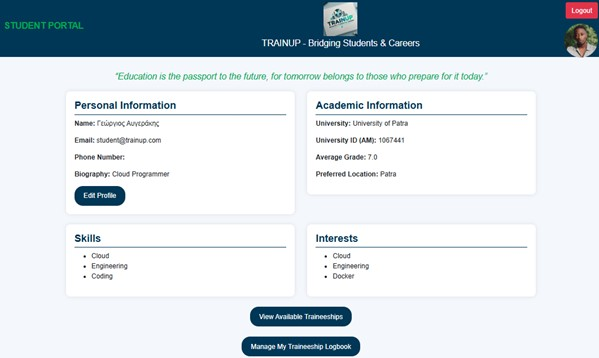
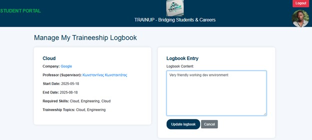

<p align="center">
  
  <br>
  <sub><em>Web app that connects students, companies, and universities for internships & training programs.</em></sub>
</p>

<h1 align="center">TrainUp (Spring Boot)</h1>

<p align="center">
  <a href="#overview">Overview</a> •
  <a href="#features">Features</a> •
  <a href="#architecture--tech">Architecture & Tech</a> •
  <a href="#screenshots">Screenshots</a> •
  <a href="#quickstart-dev">Quickstart</a>•
  <a href="#Licence">Licence</a>
</p>

---

## Overview

**TrainUp** is a Spring Boot web application that streamlines the process of discovering, applying to, and managing **internships / traineeships**.  
It bridges **Students**, **Companies**, and **University Staff** with clean role-based flows:
- Companies publish positions with requirements and capacity.
- Students browse/filter and apply; track status and offers.
- Staff/Admins moderate content, oversee matching, and manage platform settings.

---

## Features

### 👩‍🎓 Student
- Register/Login & profile (skills, interests, CV link).
- Browse **open positions** by company/category/skills.
- **Apply** with one click; see **application status** & history.
- Notifications on **status change** (accepted/rejected/offer).

### 🏢 Company
- Secure login & company profile (description, website, contact).
- **CRUD** on **Positions** (title, description, location, duration, capacity, skills).
- Review incoming **applications** per position.

### 🏛️ Admin / Staff
- User management (activate/disable, reset roles).
- Content moderation (positions, categories, skills).
- Global settings (application windows, limits).
- Dashboard: basic **stats** (positions, applications, conversion).

### 🔐 Access & Roles
- Authentication/Authorization via **Spring Security**.
- Role-based UI: `ROLE_STUDENT`, `ROLE_COMPANY`, `ROLE_ADMIN` (επεκτάσιμο).
- Server-side validation & friendly error pages.


---

## Architecture & Tech

<table>
  <tr>
    <td width="52%">
      
      <p align="center"><sub>High-level Architecture</sub></p>
    </td>
    <td width="48%" valign="top">

- **Spring Boot** (MVC): controllers, services, repositories.
- **Spring Security**: sessions & role-based access.
- **Thymeleaf** templates (server-side rendering).
- **JPA/Hibernate** over **MySQL** (or MariaDB).
- **Maven** for build & dependency management.
- Layered design: `controller → service → repository → entity`.
- Conventional packaging under `src/main/java` and `templates/`.

    </td>
  </tr>
</table>

---

## Screenshots

<table>
  <tr>
    <td width="52%">
      
      <p align="center"><sub>Student Portal — profile, academics, skills & interests.</sub></p>
    </td>
    <td width="48%" valign="top">

- Κάρτες: **Personal Information**, **Academic Information**, **Skills**, **Interests**.
- Προφίλ φοιτητή με email, bio και κουμπί **Edit Profile**.
- Quote banner στην κορυφή για τα traineeships.
- Κεντρικές ενέργειες: **View Available Traineeships**, **Manage My Traineeship Logbook**.

    </td>
  </tr>
</table>

<table>
  <tr>
    <td width="52%">
      
      <p align="center"><sub>Landing page με λογότυπο, σύντομο intro και επιλογές σύνδεσης/εγγραφής.</sub></p>
    </td>
    <td width="48%" valign="top">

- Καλωσόρισμα: “Welcome to the Traineeship Management Web Application”.
- Σύντομο tagline για **Explore, connect, and grow!**
- Κουμπιά **Login** & **Register** για γρήγορη έναρξη.
- Minimal layout που οδηγεί στη ροή αυθεντικοποίησης.

    </td>
  </tr>
</table>

<table>
  <tr>
    <td width="52%">
      
      <p align="center"><sub>Διαχείριση Logbook — στοιχεία θέσης & επεξεργασία καταχώρισης.</sub></p>
    </td>
    <td width="48%" valign="top">

- Πλαϊνή σύνοψη θέσης: **Company**, **Supervisor**, **Dates**, **Required Skills**, **Topics**.
- Φόρμα **Logbook Entry** για ημερολόγιο πρακτικής.
- Ενέργειες: **Update logbook** και **Cancel**.
- Σαφής διάκριση ενημερωτικών πεδίων και editable περιεχομένου.

    </td>
  </tr>
</table>


---

## Quickstart (dev)

### Prereqs
- **JDK 17+**
- **Maven 3.8+**
- **MySQL 8.x**

### 1) Database
Create DB & user (example names; adjust as needed):
```sql
CREATE DATABASE trainup CHARACTER SET utf8mb4 COLLATE utf8mb4_unicode_ci;
CREATE USER 'trainup_user'@'%' IDENTIFIED BY 'strong_password';
GRANT ALL PRIVILEGES ON trainup.* TO 'trainup_user'@'%';
FLUSH PRIVILEGES;

spring.jpa.hibernate.ddl-auto=update   # dev only; use validate/create for other stages
spring.jpa.show-sql=true
spring.thymeleaf.cache=false
server.port=8080
```


## License

This project is for academic purposes.
